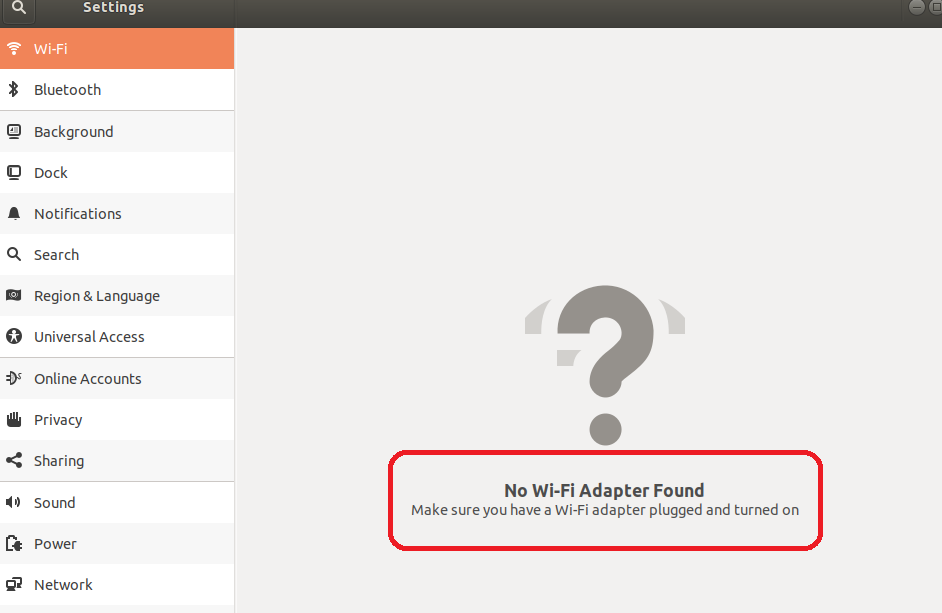
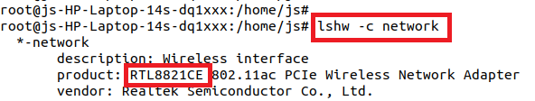
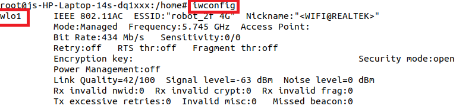
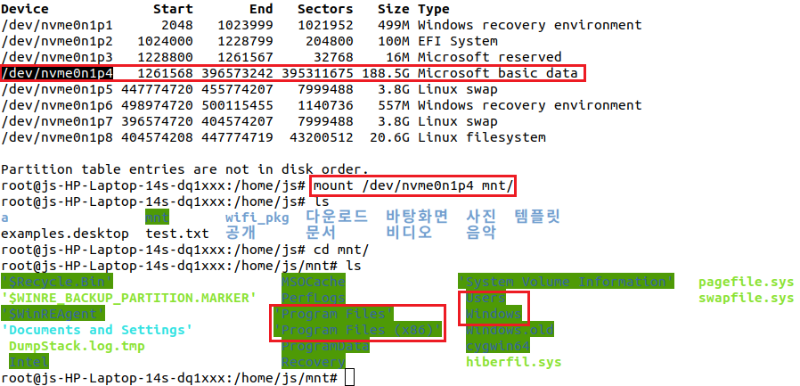
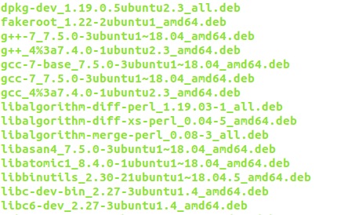
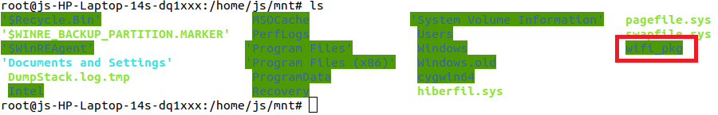
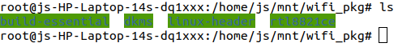
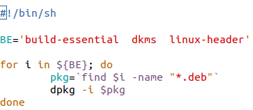

# 📡 Ubuntu 18.04 WiFi Driver 설치 방법

> 이 포스트는 리눅스 교육을 수강할 때 지급받은 노트북에 Ubuntu를 설치하며 겪었던 문제를 해결한 경험을 정리한 내용입니다.

 

# 💻 시스템 정보

- 사용한 노트북 : hp계열 노트북
- 설치한 Ubuntu 버전 : 18.04
- WiFi 랜 카드 : RTL8821CE

 

# 😭 문제 정의

- 문제 상황 : 
  듀얼 부팅을 하기 위해 Window10이 설치된 hp 노트북에 Ubuntu 18.04를 설치한 후 wifi 연결을 시도했을 때 
  아래 그림과 같이 System Setting의 wifi 항목에 'No Wifi Adapter Found'라는 메세지가 출력되고 WiFi가 정상적으로 인식되지 않는 문제가 발생했습니다.

 

- 문제 원인 : 

      This happens on many HP devices including HP 15-bs000, 15-bs100, 15g-br000, 15q-bu000, and Pavilion 15-br000, HP 280 G3, 290 G1, and more. And "the reason is Ubuntu does not support RTL8723de wifi driver".

  인터넷에서 정보를 찾던 중 위 같은 내용을 확인할 수 있었고 
  즉, '**Ubuntu가 기본적으로 Realtek계열 WiFi 드라이버를 지원하지 않았기 때문**입니다.

 

# 👍 해결 방법

> 그럼, 어떻게 해결할 수 있을까...?

Ubuntu *PPA*¹에서 해당하는 최신 rtlwifi 드라이버 소스를 내려받고 *DKMS*²를 통해 부팅 시 커널에 해당 드라이버 모듈을 적재하면 해결할 수 있다는 것을 알았습니다.

아래는 [Linux Mint Türkiye” 팀이 관리하는 PPA](https://launchpad.net/~kelebek333/+archive/ubuntu/kablosuz)에 포함된 DKMS를 지원하는 Realtek계열 WiFi 랜 카드 목록입니다.

    rtl8723bu, rtl8822bu, rtl8188eu, rtl8188fu, rtl8192cu, rtl8192du, rtl8192ee, rtl8192eu, rtl8192fu, rtl8723au, rtl8723bu, rtl8723de, rtl8723ds, rtl8723du, rtl8812au, rtl8814au, rtl8821ce, rtl8821cu, rtl8822bu

저는 타사이트의 설치 과정을 참고했기 때문에 위 PPA가 아닌 다른 git 저장소를 통해 해당 드라이버 소스를 얻었습니다.

 

## 🔸 WiFi 드라이버 설치 과정

1.  먼저, 현재 시스템의 WiFi 랜 카드 정보를 확인합니다. 

    - Windows : cmd 창에 'ipconfig /all' 명령을 입력하여 무선 랜 정보 확인
    - Ubuntu : 터미널 창에 'lshw -c network' 명령을 입력하여 Wireless interface 정보 확인
      

2.  다음 명령들을 통해 빌드 시 필요한 패키지와 dkms를 설치하고 해당 드라이버 소스를 내려받아 설치합니다. 
    (우분투 환경에서 유선 랜을 통해 인터넷 연결이 가능해야 합니다.) 

        sudo apt-get install --reinstall git dkms build-essential linux-headers-$(uname -r)
        git clone https://github.com/tomaspinho/rtl8821ce
        cd rtl8821ce
        chmod +x dkms-install.sh
        chmod +x dkms-remove.sh
        sudo ./dkms-install.sh

3.  재부팅 후 WiFi가 정상적으로 동작하는지 확인해봅시다!

    - 우측 상단의 wifi 아이콘이 표시되는지 확인합니다. 
      (제 경우 드라이버 설치 전에는 해당 아이콘이 표시되지 않았습니다.)
      

    - 터미널 창에 'iwconfig' 명령을 입력하여 wifi 인터페이스가 올라오는지 확인합니다.
      

> 위 2번 과정을 진행할 때 인터넷에 연결할 수 없는 상황이라면 어떻게 해야할까요?

유선 랜이 없고 USB같은 외부 저장 장치도 없는 상황이라면 제가 했던 방법을 시도해볼 수 있습니다. 

    Windows로 부팅하여 필요한 패키지들을 내려받은 후 'Windows가 설치된 파티션을 Ubuntu에서 마운트'하여 해당 파일들을 옮기고 설치를 진행하는 방법입니다.

그 과정 아래와 같습니다.

1.  터미널 창에 'fdisk -l' 명령을 입력하여 Disk의 파티션 정보를 확인 후 Windows가 설치된 파티션으로 추정되는 파티션을 마운트하여 Windows의 C드라이브가 맞는지 확인합니다.
     

2.  Windows로 부팅 후 필요한 패키지(dkms build-essential rtl8821ce 등)들을 받아 C드라이브에 저장합니다. 
    저는 [multipass](https://multipass.run/)를 이용해 우분투 인스턴스를 생성하여 리눅스 환경에서 apt명령으로 패키지들을 받았습니다. 
    (패키지 설치 시 종속성 문제가 있기 때문에 인터넷에서 찾아 받는 것은 상당히 하드한 작업일 수 있습니다...) 

    apt명령으로 설치한 패키지 파일들은 **/var/cache/apt/archives** 디렉토리 안에 **.deb** 확장자를 가진 데비안 패키지 파일 형태로 저장됩니다.(하단 그림 참조)

     

3.  Ubuntu로 부팅 후 1번에서 확인한 파티션을 마운트하고 2번에서 저장했던 패키지들을 가져옵니다.

    

    하단의 그림은 각 패키지의 종류에 따라 구분해 저장해놓은 디렉토리입니다.

     

4.  터미널 창에 'dpkg -i xxx.deb'(xxx는 각 패키지명) 명령을 입력하여 각각의 패키지 설치를 진행합니다. 
    (설치할 패키지 개수가 많기 때문에 아래와 같은 간단한 Shell Script를 작성해 진행하였고
    설치 순서에 따라 종속성 문제가 발생할지도 모른다고 생각되어 2~3번 추가로 실행했습니다.)

    

 

# 📙 기술 용어 정리

- PPA(Personal Package Archive) : 우분투 공식 패키지 저장소에 없는 서드 파티 소프트웨어를 위한 '**개인용 패키지 저장소**'를 의미합니다.

- DKMS(Dynamic Kernel Module Support) : 커널 부팅 시 필요에 따라 /usr/src 디렉토리에 위치한 소스를 컴파일하여 해당 모듈을 커널에 자동으로 적재하는 방식입니다. 
  (커널 변경 시 따로 모듈을 컴파일하지 않아도 자동으로 적재되므로 매우 유용한 방식입니다.)

- lshw 명령은 현재 시스템을 구성하고 있는 하드웨어 정보를 출력해줍니다.
  - -c (class) 옵션 : 특정 장치의 정보만 확인할 때 사용합니다.

 

# 📖 참고 자료

- [Fix ‘No WiFi Adapter Found’ for HP Laptops with Ubuntu 18.04](https://ubuntuhandbook.org/index.php/2018/08/no-wifi-adapter-found-hp-laptops-ubuntu-18-04/)
- [How to Install RTL8188EU, RTL8723DS or other rtlwifi Driver via PPA in Ubuntu 20.04](https://ubuntuhandbook.org/index.php/2021/01/install-rtl8188eu-rtl8723ds-drivers-ppa-ubuntu-20-04/)
- [Ubuntu on HP Realtek RTL8821CE Wifi card not detected](https://askubuntu.com/questions/1160552/ubuntu-on-hp-realtek-rtl8821ce-wifi-card-not-detected)
- [DKMS 모듈 관리](http://no1linux.org/hottips/28247)
