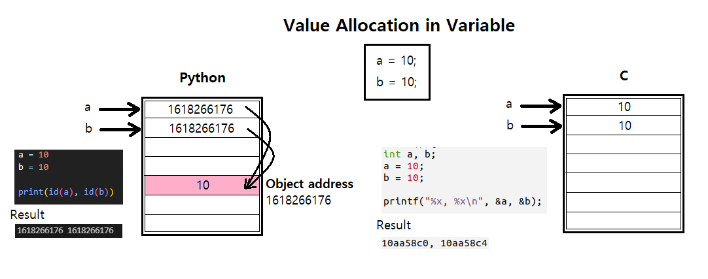
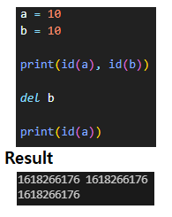
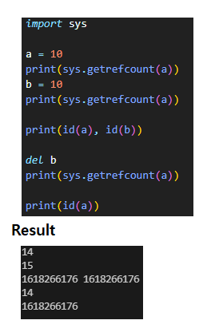

# 🔎Python vs C 변수 값 할당 차이

> Python과 C언어는 변수에 값을 할당할 때 약간의 차이가 있는 것 같습니다.

위 그림처럼 두 변수 a, b에 동일한 값(10)을 할당하고 Python과 C언어에서 각각 두 변수의 레퍼런스 값을 찍어보면 아래같은 결과가 나옵니다. 

- Python : 동일한 값을 반환
- C언어 : 서로 다른 값을 반환

이는 **Python이 변수에 값을 할당할 때 해당 값을 Object형태로 생성**한 후 변수가 그 Object의 레퍼런스 값을 가리키도록 하기 때문입니다. 
그러므로 변수 b에 a와 동일한 값을 할당하면 기존에 생성된 Object의 레퍼런스를 b도 가리키게 되어 두 변수 a, b가 동일한 레퍼런스 값을 반환하게 되는 것입니다.

 

> 그럼 만약, 변수 b를 해제하면 변수 a는 어떻게 될까요?

결론은, 하단의 좌측 그림처럼 변수 a는 여전히 Object(10)의 레퍼런스 값을 반환합니다. 

왜 이런 결과가 나왔을까요?? 상단의 우측 그림을 살펴봅시다. 
변수 b에 변수 a와 동일한 값을 할당했을 때 a의 Reference Count 값이 증가했고 변수 b를 해제했을 때 값이 다시 감소한 것을 알 수 있습니다. 
즉, **Python은 해당 Object를 Reference Count로 관리**하고 있다는 것을 알 수 있습니다. 따라서, 해당 Object를 참조하는 변수가 존재한다면 Object를 메모리에서 해제하지 않고 더 이상 참조하는 변수가 없을 때 비로소 해당 Object를 메모리 상에서 해제하게 되는 것입니다.
