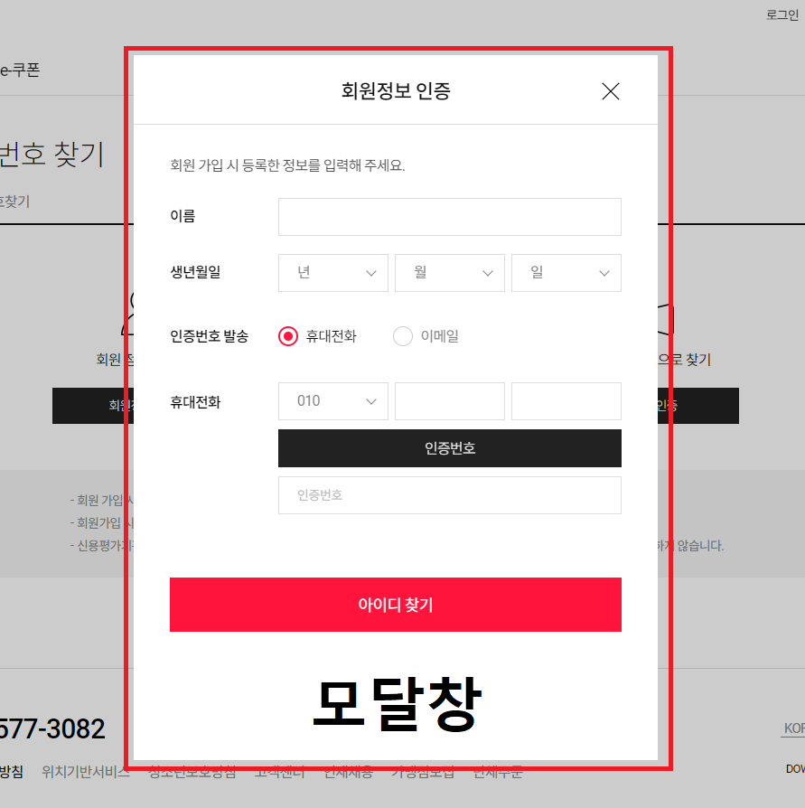

# 📌 Pop-up vs Modal

 

## 🔸 공통점

- 웹 브라우저 상의 원하는 위치와 사이즈로 새로운 창을 띄워 <strong>_사용자에게 강조하고 싶은 정보를 보여준다._</strong> (프로모션 진행, 서비스 공지, 주의사항, 안내문 등)

## 🔹 차이점

1. 창을 띄우는 시점

   - Pop-up : 보통 웹 페이지 <strong>_시작과 동시에_</strong> 나타난다.
   - Modal : 웹 서비스를 이용하는 <strong>_중간 중간_</strong> 나타난다.

2. 창에 대한 제어

   - Pop-up : 웹 브라우저의 설정을 통해 <strong>_해당 창을 띄우지 않도록 설정할 수 있다._</strong>
   - Modal : 웹 브라우저의 설정으로 <strong>_해당 창을 제어할 수 없다._</strong>

3. 창의 구성 방법

   - Pop-up : 현재 웹 페이지에서 <strong>_또다른 새로운 웹 페이지_</strong>를 띄운다. (창 + 창n)
   - Modal : 현재 웹 페이지 위에 <strong>_새로운 레이어_</strong>를 추가하여 구성한다.

4. 부모 페이지의 제어

   - Pop-up : 팝업창이 열려있는 상태로 <strong>_부모 페이지를 제어할 수 있다._</strong>
   - Modal : 모달창이 열려있는 상태로 <strong>_부모 페이지를 제어할 수 없다._</strong>

 

> 위 차이점들을 바탕으로 두 창의 용도를 다음과 같이 정리해볼 수 있을 것 같다.

- Pop-up : 사용자가 웹 서비스를 사용하려는 <strong>_목적과 상관없이_</strong> 정보를 보여줄 때
- Modal : 현재 사용하려는 서비스와 관련이 있거나 다음 단계로 진행하기 위해 <strong>_반드시 필요한_</strong> 정보를 보여줄 때
