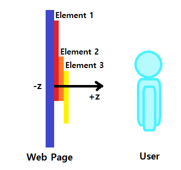
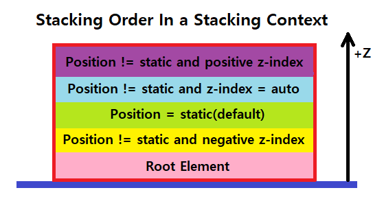
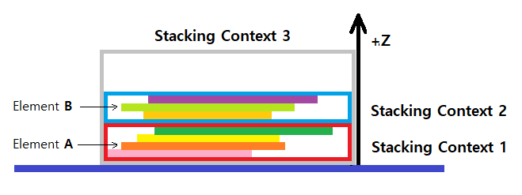

# 📚 Stacking Context

웹 페이지를 바라보는 사용자의 방향으로 가상의 z축을 세우고 이 축을 따라 쌓이는 HTML 요소들을 3차원 관점에서 개념화한 것이다. 간단히, 다른 요소의 앞이나 뒤로 함께 이동하는 동일한 부모 요소를 지닌 요소들의 그룹이라고 생각할 수 있다.

> Stacking context의 특징을 살펴보기 앞서 먼저, Stacking order에 대해 알아보자.

## 🔸 Stacking Order

- HTML 문서에 포함되는 요소들의 쌓이는 순서를 의미하며, 모든 요소는 다른 요소의 앞이나 뒤에 위치할 수 있다.

- Stacking order 결정 방식

  1. 해당 요소들에 position(=static)과 z-index 값이 없는 경우 HTML 문서에 작성된 순서를 따른다.

  2. position 값이 static이 아닌 모든 요소(자식 요소 포함)들은 position 값이 없는(=static) 요소들 앞에 위치한다. (z-index 값이 음수가 아닌 경우)

 

### 🔹 Stacking context 특징

1. 모든 Stacking context는 root 요소인 HTML 요소를 포함한다.

2. 각 Stacking context에서 쌓이는 과정은 형제자매 요소와는 독립적이며 오로지 자식 요소들에게만 영향을 준다.

3. 한 Stacking context 내에서 각 요소들이 차지하는 공간은 해당 요소들이 지닌 특정 속성 값들에 기반한 우선 순위로 결정된다.

4. 한 Stacking context는 다른 Stacking context에 포함될 수 있으며, 함께 Stacking context의 계층을 형성한다.

5. 부모와 자식 요소 각각에 쌓이는 과정이 적용된다. 먼저, 자식 요소들이 쌓인 후에 이 요소들 전체가 부모 Stacking context가 지닌 Stacking order에 따라 함께 이동하여 다른 Stacking context의 앞이나 뒤에 쌓이게 된다.

 

> 위 특징들을 좀 더 쉽게 이해하기 위해 아래와 같이 시각적으로 표현해보았다.

먼저, 위 그림은 특징 3번의 동일한 Stacking context 내에서 자식 요소들의 Stacking order를 나타낸 것이다.

- 동일한 Stacking context 내의 Stacking order
  (다음 조건이 동일한 경우 HTML 문서에 작성한 순서로 쌓인다.)
  1. root 요소
  2. static이 아닌 position 값과 음수인 z-index 값을 지닌 요소 (z-index 값이 작을 수록 뒤(아래)에 배치)
  3. position 값이 없는(=static) 요소
  4. static이 아닌 position 값과 auto인 z-index 값을 지닌 요소
  5. static이 아닌 position 값과 양수인 z-index 값을 지닌 요소 (z-index 값이 클 수록 앞(위)에 배치)

 

다음으로, 위 그림은 특징 4, 5번을 나타낸 것이다. 그림을 보면 1번, 2번 Stacking context 안에는 각각 자식 요소들이 쌓여있고, 이 둘은 각각 그룹화되어 3번 Stacking context의 자식 요소로써 Stacking order에 따라 쌓여있는 것을 알 수 있다. 

여기서, 주의할 점은 어떤 요소에서 새로운 Stacking context가 형성되면 해당 요소의 자식 요소들은 그 부모 요소가 지닌 Stacking order 내의 특정 위치에 갇힌다는 것이다. 

이것의 의미를 다음과 같이 예를 들어 살펴보면

1. 1번 Stacking context 내에 있는 요소 A
2. 1번보다 높은 Stacking order를 지닌 2번 Stacking context 내에 있는 요소 B

위 같은 상황에서 요소 A는 절대 요소 B보다 앞(위)에 위치할 수 없다는 것이다. (요소 A에 z-index 값을 100만으로 준다해도...)

 

### 🔹 새로운 Stacking context를 형성하는 4가지 방법 (이외의 방법은 [여기서](https://developer.mozilla.org/en-US/docs/Web/CSS/CSS_Positioning/Understanding_z_index/The_stacking_context) 확인)

1. Root 요소인 경우 (\<html\>)
2. 요소의 position 값이 absolute나 relative이고 z-index 값이 auto가 아닌 경우
3. 요소의 position 값이 fixed나 sticky인 경우
4. 요소의 <strong>_opacity 값이 1보다 낮은 경우_</strong>

추가적으로, z-index 속성은 오직 position 값이 static이 아닌 요소에서만 동작하며, Stacking context를 형성한다.

> 📌 Tip. CSS의 z-index 속성은 Javascript에서 zIndex로 표현된다.

 

# 📖 참고 자료

- [The stacking context by MDN](https://developer.mozilla.org/en-US/docs/Web/CSS/CSS_Positioning/Understanding_z_index/The_stacking_context)
- [What No One Told You About Z-Index [원문]](https://philipwalton.com/articles/what-no-one-told-you-about-z-index/)
- [What No One Told You About Z-Index [번역]](https://mytory.net/archives/10997)
