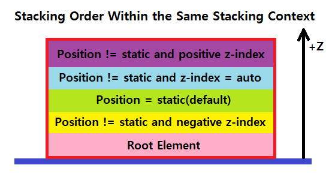

# ⬇⬆ Stacking Order

> Stacking Context를 살펴보기 앞서 먼저, Stacking Order에 대해 알아보자.

HTML 문서에 포함되는 요소들의 쌓이는 순서를 의미하며, 모든 요소는 다른 요소의 앞이나 뒤에 위치할 수 있다.

### 🔹 Stacking Order 결정 방식

1. position(=static)과 z-index(=auto) 속성이 기본값인 요소들은 HTML 문서에 작성된 순서를 따른다.
2. position 속성이 static이 아닌 모든 요소(자식 요소 포함)들은 position 속성이 기본값인 요소들 앞에 위치한다. (z-index 값이 음수가 아닌 경우)

 

# 📚 Stacking Context

웹 페이지를 바라보는 사용자의 방향으로 가상의 z축을 세우고 이 축을 따라 쌓이는 HTML 요소들을 3차원 관점에서 개념화한 것이다. 간단히, 다른 요소의 앞이나 뒤로 함께 이동하는 동일한 부모 요소를 지닌 요소들의 그룹이라고 생각할 수 있다.

### 🔹 Stacking Context 특징

1. 모든 Stacking Context는 하나의 Root 요소를 포함한다.
2. 각 Stacking Context에서 쌓임은 자식 요소들의 쌓임을 의미하며 형제 Stacking Context와는 독립적이다.
3. 한 Stacking Context 내에서 각 요소들이 차지하는 공간은 해당 요소들이 지닌 특정 속성 값들에 기반한 우선 순위로 결정된다.
4. 한 Stacking Context는 다른 Stacking Context에 포함될 수 있으며, 함께 Stacking Context의 계층을 형성한다.
5. 부모 Stacking Context가 존재하면 자식 요소들은 쌓인 후에 부모 Stacking Context의 Stacking Order에 따라 함께 이동하게 된다. (즉, 자식 요소들은 부모 Stacking Context 안에 갇힌다.)

### 🔹 새로운 Stacking Context를 형성하는 5가지 방법

1. HTML 문서의 Root 요소인 경우 (\<html\>)
2. 요소의 position 속성 값이 absolute나 relative이고 z-index 속성 값이 auto가 아닌 경우
3. 요소의 position 속성 값이 fixed나 sticky인 경우
4. 요소의 <strong>_opacity 속성 값이 1보다 낮은 경우_</strong>
5. 요소의 transform 속성 값이 none이 아닌 경우

- Stacking Context는 HTML 문서 내 어떤 요소에서도 형성할 수 있으며, 위 외에도 많은 형성 방법들이 있다. [여기서](https://developer.mozilla.org/en-US/docs/Web/CSS/CSS_Positioning/Understanding_z_index/The_stacking_context) 확인할 수 있다.
- 추가적으로, z-index 속성은 오직 position 값이 static이 아닌 요소에서만 동작하며, Stacking Context를 형성한다.

 

> 위 특징들을 좀 더 쉽게 이해하기 위해 아래와 같이 시각적으로 표현해보았다.

먼저, 위 그림은 특징 3번의 동일한 Stacking Context 내에서 자식 요소들의 Stacking Order를 나타낸 것이다.

- 동일한 Stacking Context 내의 Stacking Order (조건이 동일한 경우 HTML 문서에 작성한 순서로 쌓인다.)
  1. 해당 Stacking Context의 root 요소
  2. static이 아닌 position 값과 음수인 z-index 값을 지닌 요소 (z-index 값이 작을 수록 뒤(아래)에 배치)
  3. position 값이 없는(=static) 요소
  4. static이 아닌 position 값과 auto인 z-index 값을 지닌 요소
  5. static이 아닌 position 값과 양수인 z-index 값을 지닌 요소 (z-index 값이 클 수록 앞(위)에 배치)

 

다음으로, 위 그림은 특징 4, 5번을 나타낸 것이다. 그림을 보면 1번, 2번 Stacking Context 안에는 각각 자식 요소들이 쌓여있고, 이 둘은 각각 그룹화되어 3번 Stacking Context의 자식 Stacking Context로써 Stacking Order에 따라 쌓여있는 것을 알 수 있다. 

여기서, 주의할 점은 어떤 요소에서 새로운 Stacking Context가 형성되면 해당 요소의 자식 요소들은 그 부모 요소가 지닌 Stacking Order 내의 특정 위치에 갇힌다는 것이다. 

이것의 의미를 다음과 같이 예를 들어 살펴보면

1. 1번 Stacking Context 내에 있는 요소 A
2. 1번보다 높은 Stacking Order를 지닌 2번 Stacking Context 내에 있는 요소 B

위 같은 상황에서 요소 A는 절대 요소 B보다 앞(위)에 위치할 수 없다는 것이다. (요소 A에 z-index 값을 100만으로 준다해도...)

> 📌 Tip. CSS의 z-index 속성은 Javascript에서 zIndex로 표현된다.

 

# 🧐 Stacking Context에 대한 분석

> Stacking Context에 대한 이해가 명확하지 않다고 생각하여 아래 그림과 같이 Stacking Context를 생성하는 요소의 위치에 변화를 주며 테스트를 수행하였다

빨간 글씨로 표기된 요소가 Stacking Context를 생성하는 요소이다.

> 실제로 article 요소가 Stacking Context의 Root 요소는 아니지만 구역을 나누기 위해 사용하였다.

- ### 📄 Stacking Context 전체 테스트 코드 : [html](src/stacking_context.html) & [css](src/stacking_context.css)

- ### 🔎 Case별 분석

  아래 코드들은 전체 테스트 코드 중 분석에 필요한 일부이다.

  1️⃣ 형제 요소에서 Stacking Context가 형성되었을 때

      # HTML
        
Static

        
Negative

        
Positive

        
Auto

      # CSS
        .stacic_1 {}
        .negative_1 { position: relative; z-index: -1; }
        .auto_1 { position: relative; }
        .positive_1 { position: relative; z-index: 1; }

  위 Stacking Context를 형성하는 조건에 의하면 1번 상황에서 Stacking Context는 총 3개 생성될 것이며, 각각은 \<html\> 요소와 negative_1, positive_1 요소가 생성할 것이다. 다음은 이에 대한 쌓임 구조를 시각적으로 표현해본 그림이다. (Stacking Context를 볼륨있게 표현하였다.)

    

    
    

  포함 관계는 \<html\> 요소의 Stacking Context가 negative_1과 positive_1 요소의 Stacking Context를 포함하고 있고, 각 요소들은 위 그림과 같이 Stacking Order에 따라 순서에 맞게 쌓여져 있었다. 1번의 경우는 이해하는 데 있어 큰 어려움은 없었다. 

  만약, CSS를 설정하지 않았다면 각 요소들의 Stacking Order는 HTML 문서의 작성 순서에 따라 static_1 > negative_1 > positive_1 > auto_1 순으로 쌓였을 것이다. 

     

  2️⃣ 자식 요소에서 Stacking Context가 형성되었을 때 Case_1

      # HTML
        

          Static
          
Negative

          
Positive

          
Auto

        

      # CSS
        .stacic_2 {}
        .negative_2 { position: relative; z-index: -1; }
        .auto_2 { position: relative; }
        .positive_2 { position: relative; z-index: 1; }

  2번 상황은 1번 상황과 동일하다. 차이점이 있다면 Stacking Context를 생성하는 negative_2, positive_2 요소가 static_2 요소의 자식 요소라는 점인데, 이로인해 쌓이는 과정이 수행될 때 negative_2와 positive_2 요소가 static_2 요소 내에서 쌓일 것이라고 생각했다. 하지만 예상과 달리 <strong>static_2 요소는 Stacking Context가 아니었기 때문에 부모-자식 요소에 관계없이</strong> \<html\> 요소의 Stacking Context 내에서 각 요소들이 1번 상황과 동일하게 쌓이는 것을 확인할 수 있었다.

     

  3️⃣ 자식 요소에서 Stacking Context가 형성되었을 때 Case_2

      # HTML
        

          Static
          

            Negative
            
Positive

          

          
Auto

        

      # CSS
          .stacic_3 {}
          .negative_3 { position: relative; z-index: -1; }
          .auto_3 { position: relative; }
          .positive_3 { position: relative; z-index: 1; }

  Stacking Context의 생성 개수나 생성 요소는 위 상황들과 동일하다. 하지만 큰 차이점이 하나 있는데, 그건 Stacking Context를 생성하는 positive_3 요소가 또다른 Stacking Context를 생성하는 negative_3 요소 안에 포함되어 있다는 것이다. 마치 \<html\> 요소의 Stacking Context 안에 다른 Stacking Context가 포함되어 있는 것처럼... 이 상황은 위 Stacking Context의 특징 중 5번에 해당한다. 설명에 앞서 좀더 쉬운 이해를 위해 이에 대한 쌓임 구조를 시각적으로 표현해보았다.

  

    
  

  그림으로 확인해보니 1, 2번 상황과 분명한 차이가 있었다. z-index 값이 높을수록 높은 Stacking Order를 가지기 때문에 positive_3 요소가 다른 요소들의 최상단(앞)에 쌓일 것 같았지만, negative_3 요소가 <strong>부모 Stacking Context로 존재했기 때문에 positive_3 요소의 Stacking Order는 negative_3 요소의 Stacking Context 내에서만 유효</strong>했다.

  - Stacking Context : \<html\>
    - Stacking Context : Negative (negative_3)
      - Stacking Context : Positive (positive_3)
    - static_3
    - auto_3

  따라서, 위와 같은 Stacking Context 계층이 형성되었을 것이고 positive_3 요소가 negative_3 요소의 Stacking Order에 따라 함께 이동하여 static_3 요소보다도 아래(뒤)쪽에 쌓이는 것을 확인할 수 있었다.

 

4️⃣ 형제 요소의 자식 요소에서 Stacking Context가 형성되었을 때

      # HTML
        

          Static
          
Positive

        

        

          Auto
          
Negative

        

      # CSS
          .stacic_3 {}
          .negative_3 { position: relative; z-index: -1; }
          .auto_3 { position: relative; }
          .positive_3 { position: relative; z-index: 1; }

위 2번 상황과 매우 유사하며, 동일한 관점에서 생각해볼 수 있다. Stacking Context를 생성하는 positive_4와 negative_4 요소는 각각 static_4와 auto_4 요소의 자식 요소이지만, 이 두 요소는 Stacking Context를 생성하지 않기 때문에 각 요소들은 \<html\>요소의 Stacking Context 내에서 1, 2번 상황과 동일한 형태로 쌓이는 것을 확인할 수 있었다.

 

## 🙏🏼 결론

Stacking Context를 형성하는 요소들의 쌓이는 순서는 단순히 해당 요소가 어떤 요소에 포함되어(부모-자식 관계) 있다고하여 영향을 받는 것이 아니라 해당 Stacking Context를 포함하고 있는 가장 가까운 Stacking Context를 기준으로 각 요소들의 쌓이는 순서가 결정된다고 할 수 있다.

 

# 📖 참고 자료

- [The stacking context by MDN](https://developer.mozilla.org/en-US/docs/Web/CSS/CSS_Positioning/Understanding_z_index/The_stacking_context)
- [What No One Told You About Z-Index [원문]](https://philipwalton.com/articles/what-no-one-told-you-about-z-index/)
- [What No One Told You About Z-Index [번역]](https://mytory.net/archives/10997)
